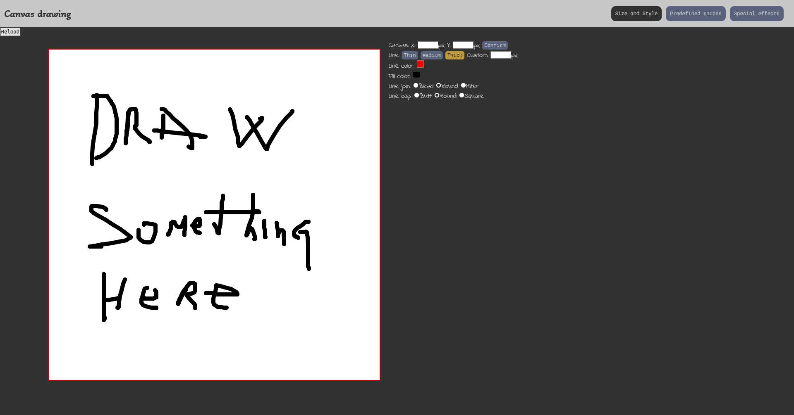

# Canvas-project
 
> Canvas project from Wes Bos 30 days coding challenge -
The goal of this project is to make an app for drawing using canvas Tag in HTML file following a tutorial on YouTube by Wes Bos. The tutorial was completed on the main branch so now I developed an upgraded version on My-feature Branch. Still need some improvements before merging.

## Built With

- HTML5
- CSS3
- Java Script

## Live Demo

[Live Demo Link](https://AleksandarIvezic.github.io/Canvas-project/)

## Getting Started

No prerequisites

To get  a local copy:
 
- Cloning repository:
 1. Press the green button `"Code"` and copy the link bellow
 2. Then open terminal or Git Bash in a folder where you want to copy the repository
 3. Type the command `"git clone"` and paste the address that you copied
 4. Press "Enter"
 5. Find the `"index.html"` file and double click on it
- Download zip file:
 1. Press the green button `"Code"` and press `"Download ZIP"`
 2. Save the file and extract it in any folder you wish
 3. Find the `"index.html"` file in extracted file and double click on it
  
To run it online just click on [Live Demo Link](https://shinobiwarior.github.io/Canvas-project/)

## Author

👤 **Aleksandar Ivezic**

- GitHub: [Aleksandar Ivezic](https://github.com/ShinobiWarior)
- Twitter: [@Aivezic](https://twitter.com/Aivezic)
- LinkedIn: [Aleksandar Ivezic](https://www.linkedin.com/in/aleksandar-ivezic/)

## 🤝 Contributing

Contributions, issues, and feature requests are welcome!

Feel free to check the [issues page](https://github.com/ShinobiWarior/Canvas-project/issues).

## Show your support

Give a ⭐️ if you like this project!
